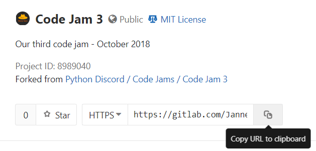

# Code Jam 3

In a survery we recently conducted, we asked what theme people wanted to see for this code jam. The most popular option, 
with 26/115 votes, was **The world ends in 10 minutes**. Thus, the task for this code jam involves creating a game under that theme.

This task is a little more freeform than the other code jams we've had so far - we're happy to accept games in any form, 
*as long as they fit that theme.* You may use PyGame, Kivy, Curses/Unicurses, Pyxel, web frameworks like Flask, or anything else 
your team desires. **Please provide instructions on how to set up and run your game within the README where necessary**.

Remember that teamwork is paramount - You *will need to work together*. For this jam, we've assigned a leader for each team 
based on their responses to the application form. Remember to listen to your leader, and communicate with the rest of your team!

# Tips

* Please lint your code, and listen to the linter. We recommend **flake8**, and you can use `pipenv run lint` to run it.
* Remember to work closely with the rest of your team.
* We're not expecting the next Assassins Creed or God of War. Don't get too ambitious and overstretch yourselves - 
  it's much better to have a finished project.
* Remember to fill out the __Project Information__ section below.
* If you haven't used Git before or have other questions about the task or code jam, we recommend reading 
  [the Code Jam section on our wiki](https://wiki.pythondiscord.com/wiki/jams).

# Setting Up

As usual, you should be using [Pipenv](https://pipenv.readthedocs.io/en/latest/). Take a look 
[at the documentation](https://pipenv.readthedocs.io/en/latest/) if you've never used it before. In short:

* Setting up for development: `pipenv install --dev`
* Running the application (assuming you use our project layout): `pipenv run start`

# Project Information

`# TODO`

## Description

`# TODO`

## How to run

You need Python and Git installed on your system.

1. Install pipenv.

2. Copy the URL of the repository.

3. Clone the repository locally.

4. Enter the directory.

5. Install the dependencies.

6. Run the game.

## How to play

`# TODO`
